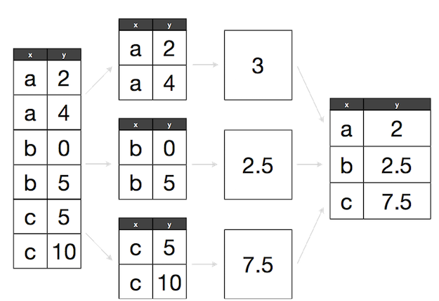
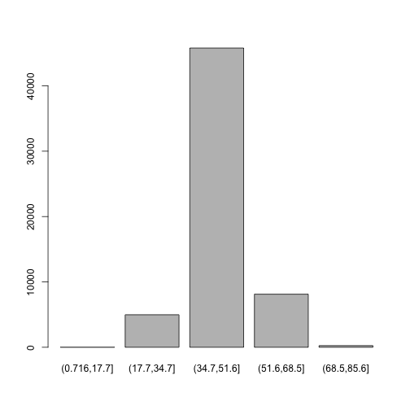

## Working with the Split-Apply-Combine Pattern
Grouping data is a powerful method in exploratory data analysis. In this section, we’ll learn a common data analysis pattern used to group data, apply a function to each group, and then combine the results. This pattern is **split-apply-combine**, a widely used strategy in data analysis:

### Split-Apply-Combine strategy using standard R functions

We will be using the same dataset as in the previous lessons (Dataset_S1.txt).

~~~
d <- read.csv("https://raw.githubusercontent.com/vsbuffalo/bds-files/master/chapter-08-r/Dataset_S1.txt")
~~~
{: .r}

One way we can extract information from complex datasets is by reducing the resolution of 
the data through _binning_ (or _discretization_). Binning takes continuous numeric values and places 
them into a discrete number of ranged bins. The benefit is that discrete bins facilitate 
conditioning on a variable. Conditioning is an incredibly powerful way to reveal patterns in data. 

In R, we bin data through the `cut()` function:

~~~
d$GC.binned <- cut(d$percent.GC, 5)
head(d$GC.binned)
~~~
{: .r}

~~~
[1] (51.6,68.5] (34.7,51.6] (34.7,51.6] (34.7,51.6] (34.7,51.6] (34.7,51.6]
5 Levels: (0.716,17.7] (17.7,34.7] (34.7,51.6] ... (68.5,85.6]
~~~
{: .output}

When `cut()`’s second argument breaks is a single number, `cut()` divides the data into that 
number of equally sized bins. The returned object is a factor. The levels of the factor 
returned from `cut()` will always have labels like (34.7,51.6], which indicate the particular 
bin that value falls in. We can count how many items fall into a bin using `table()`:

~~~
table(d$GC.binned)
~~~
{: .r}

~~~

(0.716,17.7]  (17.7,34.7]  (34.7,51.6]  (51.6,68.5]  (68.5,85.6] 
           6         4976        45784         8122          252 
~~~
{: .output}

We can also use prespecified ranges when binning data with `cut()` by setting breaks to a vector:

~~~
cut(d$percent.GC, c(0, 25, 50, 75, 100))
~~~
{: .r}

Bar plots are the natural visualization tool to use when looking at count data like the number 
of occurrences in bins created with `cut()`. We can use the `plot` function to quickly visualize our results:

~~~
plot(d$GC.binned)
~~~
{: .r}

In our previous lesson we saw that both low and high GC-content windows have lower sequencing depth. 
Let's make some numeric summaries for this pattern. We'll begin with the mean depth for the 
five GC bins we created for the d dataframe.  

The first step is to split our data. Splitting data combines observations into groups based on the 
levels of the grouping factor. We split a dataframe or vector using `split(x, f)`, where x is a 
dataframe/vector and f is a factor. In this example, we’ll split the `d$depth` column into a list 
based on the factor column `d$GC.binned`:

~~~
d_split <- split(d$depth, d$GC.binned)
str(d_split)
~~~
{: .r}

~~~
List of 5
 $ (0.716,17.7]: num [1:6] 4.57 1.12 6.95 2.66 3.69 3.87
 $ (17.7,34.7] : num [1:4976] 8 8.38 9.02 10.31 12.09 ...
 $ (34.7,51.6] : num [1:45784] 6.68 9.06 10.26 8.06 7.05 ...
 $ (51.6,68.5] : num [1:8122] 3.41 7 6.63 7.15 6.97 4.77 5.18 6.6 6.62 5.05 ...
 $ (68.5,85.6] : num [1:252] 8.04 1.96 3.71 1.97 4.82 4.22 3.76 3.84 1.85 1.05 ...
~~~
{: .output}

With our data split into groups, we can then apply a function to each group using the `lapply()` function. 

> ## Applying Functions to Lists with `lapply()`
> Applying functions to data rather than writing explicit loops follows 
> from a functional-programming style of R. Although, we focus on `lapply()` 
> the same ideas extend to other R data structures through similar “apply” functions.
>
> Let’s work through a simple example on artificial data first. Suppose, 
> you have a list of numeric values (here, generated at random with `rnorm()`):
> 
> ~~~
> ll <- list(a=rnorm(6, mean=1), b=rnorm(6, mean=4), c=rnorm(6, mean=6)) 
> ll
> ~~~
> {: .r}
> 
> 
> 
> ~~~
> $a
> [1] 2.1195755 0.8224503 0.5801468 1.7864819 2.0099981 0.6126592
> 
> $b
> [1] 3.503887 2.914993 3.222623 3.749172 6.672817 4.095242
> 
> $c
> [1] 5.740645 7.460689 5.302057 7.474057 5.896184 5.608560
> ~~~
> {: .output}
> How might we calculate the mean of each vector stored in this list? If you’re familiar 
> with for loops in other languages, you may approach this problem using R’s for loops:
>  
>  ~~~
>  > # create an empty numeric vector for the means
>  > ll_means <- numeric(length(ll))
>  > # loop over each list element and calculate mean
>  > for (i in seq_along(ll)) { 
>   ll_means[i] <- mean(ll[[i]])
>  > }
>  ~~~
>  {: .r}
>  
>  
>  
>  ~~~
>  Error: <text>:1:1: unexpected '>'
>  1: >
>      ^
>  ~~~
>  {: .error}
> However, a better approach is to use an apply function that applies another 
> function to each list element. For example, to calculate the mean of each 
> list element, we’d want to apply the function `mean()` to each element. 
> To do so, we can use the function lapply() (the l is for list, as `lapply()` 
> returns the result as a list):
>  
>  ~~~
>  > lapply(ll, mean) $a
>  ~~~
>  {: .r}
>  
>  
>  
>  ~~~
>  Error: <text>:1:1: unexpected '>'
>  1: >
>      ^
>  ~~~
>  {: .error}
> `lapply()` has several advantages: it creates the output list for us, 
> uses fewer lines of code, leads to clearer code, and is in some cases faster 
> than using a for loop. While using `lapply()` rather than loops admittedly 
> takes time getting used to, it’s worth the effort.
>
{: .callout}

Let’s find the mean depth of each GC bin by applying the function `mean()` to d_split:

~~~
lapply(d_split, mean)
~~~
{: .r}

~~~
$`(0.716,17.7]`
[1] 3.81

$`(17.7,34.7]`
[1] 8.788244

$`(34.7,51.6]`
[1] 8.296699

$`(51.6,68.5]`
[1] 7.309941

$`(68.5,85.6]`
[1] 4.037698
~~~
{: .output}

Finally, the last step is to combine this data together somehow (because it’s currently split). We can simplify our split-apply results by converting it to a vector. One way to do this is to call `unlist()`, which returns a vector with the highest type it can:

~~~
unlist(lapply(d_split, mean))
~~~
{: .r}

~~~
(0.716,17.7]  (17.7,34.7]  (34.7,51.6]  (51.6,68.5]  (68.5,85.6] 
    3.810000     8.788244     8.296699     7.309941     4.037698 
~~~
{: .output}

Equivalently, we could just replace our call to `lapply()` with `sapply()` 
(the `sapply()` function is similar to `lapply()`, except that it simplifies 
the results into a vector, array, or matrix):

~~~
sapply(d_split, mean)
~~~
{: .r}

~~~
(0.716,17.7]  (17.7,34.7]  (34.7,51.6]  (51.6,68.5]  (68.5,85.6] 
    3.810000     8.788244     8.296699     7.309941     4.037698 
~~~
{: .output}

Now, let’s look at an example that involves a slightly trickier combine step: applying the `summary()` function to each group. We’ll run both the split and apply steps in one expression:

~~~
dpth_summ <- lapply(split(d$depth, d$GC.binned), summary)
dpth_summ
~~~
{: .r}

~~~
$`(0.716,17.7]`
   Min. 1st Qu.  Median    Mean 3rd Qu.    Max. 
  1.120   2.918   3.780   3.810   4.395   6.950 

$`(17.7,34.7]`
   Min. 1st Qu.  Median    Mean 3rd Qu.    Max. 
  1.000   7.740   8.715   8.788   9.800  17.780 

$`(34.7,51.6]`
   Min. 1st Qu.  Median    Mean 3rd Qu.    Max. 
  1.000   7.100   8.260   8.297   9.470  21.910 

$`(51.6,68.5]`
   Min. 1st Qu.  Median    Mean 3rd Qu.    Max. 
   1.00    6.03    7.25    7.31    8.54   21.18 

$`(68.5,85.6]`
   Min. 1st Qu.  Median    Mean 3rd Qu.    Max. 
  1.000   2.730   3.960   4.038   5.152   9.710 
~~~
{: .output}

dpth_summ is a list of depth summary tables for each GC bin. The routine way to combine a list of vectors is by binding each element together into a matrix or dataframe using either `cbind()` (column bind) or `rbind()` (row bind). For example:

~~~
rbind(dpth_summ[[1]], dpth_summ[[2]])
~~~
{: .r}

~~~
     Min. 1st Qu. Median  Mean 3rd Qu.  Max.
[1,] 1.12   2.918  3.780 3.810   4.395  6.95
[2,] 1.00   7.740  8.715 8.788   9.800 17.78
~~~
{: .output}

~~~
#or
cbind(dpth_summ[[1]], dpth_summ[[2]])
~~~
{: .r}

~~~
         [,1]   [,2]
Min.    1.120  1.000
1st Qu. 2.918  7.740
Median  3.780  8.715
Mean    3.810  8.788
3rd Qu. 4.395  9.800
Max.    6.950 17.780
~~~
{: .output}

However, this approach won’t scale well if we needed to bind together many list elements.
Instead, we can use R’s `do.call()` function, which takes a function and a list as arguments, 
and calls the function using the list as the function’s arguments. We can use `do.call()` 
with `rbind()` to merge the list our split-apply steps produces into a matrix:

~~~
do.call(rbind, dpth_summ)
~~~
{: .r}

~~~
             Min. 1st Qu. Median  Mean 3rd Qu.  Max.
(0.716,17.7] 1.12   2.918  3.780 3.810   4.395  6.95
(17.7,34.7]  1.00   7.740  8.715 8.788   9.800 17.78
(34.7,51.6]  1.00   7.100  8.260 8.297   9.470 21.91
(51.6,68.5]  1.00   6.030  7.250 7.310   8.540 21.18
(68.5,85.6]  1.00   2.730  3.960 4.038   5.152  9.71
~~~
{: .output}

We can also combine all our split-apply-combine operations in a single command:

~~~
do.call(rbind, lapply(split(d$depth, d$GC.binned), summary))
~~~
{: .r}

~~~
             Min. 1st Qu. Median  Mean 3rd Qu.  Max.
(0.716,17.7] 1.12   2.918  3.780 3.810   4.395  6.95
(17.7,34.7]  1.00   7.740  8.715 8.788   9.800 17.78
(34.7,51.6]  1.00   7.100  8.260 8.297   9.470 21.91
(51.6,68.5]  1.00   6.030  7.250 7.310   8.540 21.18
(68.5,85.6]  1.00   2.730  3.960 4.038   5.152  9.71
~~~
{: .output}

Combining this data such that the quantiles and means are columns is the natural way to represent it. 
Replacing `rbind` with `cbind` in `do.call()` would swap the rows and columns.

> ## Confused about `lapply` and `do.call`?
> * `lapply` applies a function to all elements of a list,  
> * `do.call calls a function where all the function arguments are in a list. 
> So for a n element list, lapply has n function calls, and do.call has just one function call.
> 
> ~~~
> do.call(sum, list(1,2,4,1,2))
> ~~~
> {: .r}
> 
> 
> 
> ~~~
> [1] 10
> ~~~
> {: .output}
> 
> 
> 
> ~~~
> lapply(list(1,2,4,1,2), sum)
> ~~~
> {: .r}
> 
> 
> 
> ~~~
> [[1]]
> [1] 1
> 
> [[2]]
> [1] 2
> 
> [[3]]
> [1] 4
> 
> [[4]]
> [1] 1
> 
> [[5]]
> [1] 2
> ~~~
> {: .output}
{: .callout}

> ## More useful tricks
>
> There are a few other useful tricks to know about the split-apply-combine pattern built from `split()`, 
> `lapply()`, and `do.call()` with `rbind()` that are worth mentioning. _First_, it’s possible to group 
> by more than one factor—just provide `split()` with a list of factors. `split()` will split the data 
> by all combinations of these factors. _Second_, you can unsplit a list back into its original vectors 
> using the function `unsplit()`. `unsplit()` takes a list and the same factor (or list of factors) used 
> as the second argument of `split()` to reconstruct the new list back into its original form. Third, 
> although we split single columns of a dataframe (which are just vectors), `split()` will happily split 
> dataframes. Splitting entire dataframes is necessary when your apply step requires more than one column. 
> For example, if you wanted to fit separate linear models for each set of observations in a group, you 
> could write a function that takes each dataframe passed `lapply()` and fits a model using its column with `lm()`.
{: .callout}

Lastly, R has some convenience functions that wrap the `split()`, `lapply()`, and combine steps. For example, 
the functions `tapply()` and `aggregate()` can be used to create per-group summaries too:

~~~
tapply(d$depth, d$GC.binned, mean)
~~~
{: .r}

~~~
(0.716,17.7]  (17.7,34.7]  (34.7,51.6]  (51.6,68.5]  (68.5,85.6] 
    3.810000     8.788244     8.296699     7.309941     4.037698 
~~~
{: .output}

~~~
aggregate(d$depth, list(gc=d$GC.binned), mean)
~~~
{: .r}

~~~
            gc        x
1 (0.716,17.7] 3.810000
2  (17.7,34.7] 8.788244
3  (34.7,51.6] 8.296699
4  (51.6,68.5] 7.309941
5  (68.5,85.6] 4.037698
~~~
{: .output}

Both `tapply()` and `aggregate()` have the same split-apply-combine pattern at their core, but vary slightly 
in the way they present their output. If you’re interested in similar functions in R, see the help pages 
for `aggregate()`, `tapply()`, and `by()`.

### Exploring Dataframes with dplyr

Every data analysis you conduct will likely involve manipulating dataframes at some point. Quickly extracting, 
transforming, and summarizing information from dataframes is an essential R skill. In this part we'll use Hadley 
Wickham’s dplyr package, which consolidates and simplifies many of the common operations we perform on dataframes. 
In addition, much of dplyr key functionality is written in C++ for speed.

~~~
if (!require("dplyr")) install.packages("dplyr") # install dplyr if it's not already installed
library(dplyr)
~~~
{: .r}

dplyr has five basic functions for manipulating dataframes: `arrange()`, `filter()`, `mutate()`, `select()`, 
and `summarize()`. None of these functions perform tasks you can’t accomplish with R’s base functions. 
But dplyr’s advantage is in the added consistency, speed, and versatility of its data manipulation interface. 
dplyr’s design drastically simplifies routine data manipulation and analysis tasks, allowing you to more 
easily and effectively explore your data.

Because it’s common to work with dataframes with more rows and columns than fit in your screen, `dplyr` uses 
a simple class called `tbl_df` that wraps dataframes so that they don’t fill your screen when you print them 
(similar to using `head()`). Let’s convert our `d` dataframe into a `tbl_df` object with the `tbl_df()` function:

~~~
d_df <- tbl_df(d)
d_df
~~~
{: .r}

~~~
# A tibble: 59,140 × 18
   start   end total.SNPs total.Bases depth unique.SNPs dhSNPs
   <int> <int>      <int>       <int> <dbl>       <int>  <int>
1  55001 56000          0        1894  3.41           0      0
2  56001 57000          5        6683  6.68           2      2
3  57001 58000          1        9063  9.06           1      0
4  58001 59000          7       10256 10.26           3      2
5  59001 60000          4        8057  8.06           4      0
6  60001 61000          6        7051  7.05           2      1
7  61001 62000          7        6950  6.95           2      1
8  62001 63000          1        8834  8.83           1      0
9  63001 64000          1        9629  9.63           1      0
10 64001 65000          3        7999  8.00           1      1
# ... with 59,130 more rows, and 11 more variables: reference.Bases <int>,
#   Theta <dbl>, Pi <dbl>, Heterozygosity <dbl>, percent.GC <dbl>,
#   Recombination <dbl>, Divergence <dbl>, Constraint <int>, SNPs <int>,
#   GC.binned <fctr>, diversity <dbl>
~~~
{: .output}

#### Select columns with `select()` 

Use dplyr’s `select()` function to select (or to omit) specific columns:

~~~
select(d_df, start, end, Pi, Recombination, depth) #equivalent to d[, c("start", "end", "Pi", "Recombination", "depth")]
~~~
{: .r}

~~~
# A tibble: 59,140 × 5
   start   end     Pi Recombination depth
   <int> <int>  <dbl>         <dbl> <dbl>
1  55001 56000  0.000   0.009601574  3.41
2  56001 57000 10.354   0.009601574  6.68
3  57001 58000  1.986   0.009601574  9.06
4  58001 59000  9.556   0.009601574 10.26
5  59001 60000  8.506   0.009601574  8.06
6  60001 61000  9.121   0.009601574  7.05
7  61001 62000  8.062   0.009601574  6.95
8  62001 63000  2.065   0.009601574  8.83
9  63001 64000  1.879   0.009601574  9.63
10 64001 65000  5.408   0.009584180  8.00
# ... with 59,130 more rows
~~~
{: .output}

Note that `dplyr` uses special evaluation rules that allow you to omit quoting column names in its functions.

#### Filter rows with `filter()`

Use dplyr's `filter()` function to select specific rows:

~~~
filter(d_df, Pi > 16, percent.GC > 80) #equivalent to d[d$Pi > 16 & d$percent.GC > 80, ]
~~~
{: .r}

~~~
# A tibble: 3 × 18
     start      end total.SNPs total.Bases depth unique.SNPs dhSNPs
     <int>    <int>      <int>       <int> <dbl>       <int>  <int>
1 63097001 63098000          5         947  2.39           2      1
2 63188001 63189000          2        1623  3.21           2      0
3 63189001 63190000          5        1395  1.89           3      2
# ... with 11 more variables: reference.Bases <int>, Theta <dbl>,
#   Pi <dbl>, Heterozygosity <dbl>, percent.GC <dbl>, Recombination <dbl>,
#   Divergence <dbl>, Constraint <int>, SNPs <int>, GC.binned <fctr>,
#   diversity <dbl>
~~~
{: .output}

#### Arrange rows with `arrange()`

Arrange rows = sort columns with the function `arrange()`:

~~~
arrange(d_df, depth) #equivalent to `d[order(d$depth), ]`
~~~
{: .r}

~~~
# A tibble: 59,140 × 18
      start      end total.SNPs total.Bases depth unique.SNPs dhSNPs
      <int>    <int>      <int>       <int> <dbl>       <int>  <int>
1   1234001  1235000          0         444     1           0      0
2   1584001  1585000          0         716     1           0      0
3   2799001  2800000          0         277     1           0      0
4   2800001  2801000          0         115     1           0      0
5   7092001  7093000          0         519     1           0      0
6   7093001  7094000          2         686     1           2      0
7  11611001 11612000          1         429     1           1      0
8  12781001 12782000          0         165     1           0      0
9  25765001 25766000          0         221     1           0      0
10 25770001 25771000          0         172     1           0      0
# ... with 59,130 more rows, and 11 more variables: reference.Bases <int>,
#   Theta <dbl>, Pi <dbl>, Heterozygosity <dbl>, percent.GC <dbl>,
#   Recombination <dbl>, Divergence <dbl>, Constraint <int>, SNPs <int>,
#   GC.binned <fctr>, diversity <dbl>
~~~
{: .output}

You can sort a column in descending order using `arrange()` by wrapping its name in the function `desc()`. 
Also, additional columns can be specified to break ties:

~~~
arrange(d_df, desc(total.SNPs), desc(depth))
~~~
{: .r}

~~~
# A tibble: 59,140 × 18
      start      end total.SNPs total.Bases depth unique.SNPs dhSNPs
      <int>    <int>      <int>       <int> <dbl>       <int>  <int>
1   2621001  2622000         93       11337 11.34          13     10
2  13023001 13024000         88       11784 11.78          11      1
3  47356001 47357000         87       12505 12.50           9      7
4  59992001 59993000         84       11553 11.55          15      6
5   8769001  8770000         83       10253 10.25          12      7
6  17840001 17841000         81       13347 13.35          11      8
7  47355001 47356000         80       14218 14.22           8      7
8  45888001 45889000         80        9820  9.82          11     10
9  24897001 24898000         78       11206 11.21          16     14
10 54457001 54458000         76        9691  9.69          12      4
# ... with 59,130 more rows, and 11 more variables: reference.Bases <int>,
#   Theta <dbl>, Pi <dbl>, Heterozygosity <dbl>, percent.GC <dbl>,
#   Recombination <dbl>, Divergence <dbl>, Constraint <int>, SNPs <int>,
#   GC.binned <fctr>, diversity <dbl>
~~~
{: .output}

#### Add new columns with `mutate()`

Using dplyr’s `mutate()` function, we can add new columns to our dataframe: For example, we added a rescaled version of the Pi column as `d$diversity`—let’s drop d $diversity using `select()` and then recalculate it:

~~~
d_df <- select(d_df, -diversity) # remove our earlier diversity column
d_df <- mutate(d_df, diversity = Pi/(10*1000))
d_df
~~~
{: .r}

~~~
# A tibble: 59,140 × 18
   start   end total.SNPs total.Bases depth unique.SNPs dhSNPs
   <int> <int>      <int>       <int> <dbl>       <int>  <int>
1  55001 56000          0        1894  3.41           0      0
2  56001 57000          5        6683  6.68           2      2
3  57001 58000          1        9063  9.06           1      0
4  58001 59000          7       10256 10.26           3      2
5  59001 60000          4        8057  8.06           4      0
6  60001 61000          6        7051  7.05           2      1
7  61001 62000          7        6950  6.95           2      1
8  62001 63000          1        8834  8.83           1      0
9  63001 64000          1        9629  9.63           1      0
10 64001 65000          3        7999  8.00           1      1
# ... with 59,130 more rows, and 11 more variables: reference.Bases <int>,
#   Theta <dbl>, Pi <dbl>, Heterozygosity <dbl>, percent.GC <dbl>,
#   Recombination <dbl>, Divergence <dbl>, Constraint <int>, SNPs <int>,
#   GC.binned <fctr>, diversity <dbl>
~~~
{: .output}

#### Chaining

So far we’ve been using dplyr to get our dataframes into shape by selecting columns, filtering and 
arranging rows, and creating new columns. In daily work, you’ll need to use these and other dplyr 
functions to manipulate and explore your data. While we could assign output after each step to an 
intermediate variable, it’s easier (and more memory efficient) to chain dplyr operations. To make 
it easier to read and create data-processing pipelines, dplyr uses `%>%` (known as pipe) from the 
`magrittr` package. Using pipes in dplyr allows us to clearly express complex data manipulation operations:

~~~
d_df %>%  mutate(GC.scaled = scale(percent.GC)) %>% 
          filter(GC.scaled > 4, depth > 4) %>%
          select(start, end, depth, GC.scaled, percent.GC) %>%
          arrange(desc(depth))
~~~
{: .r}

~~~
# A tibble: 18 × 5
      start      end depth GC.scaled percent.GC
      <int>    <int> <dbl>     <dbl>      <dbl>
1  62535001 62536000  7.66  4.040263    73.9740
2  63065001 63066000  6.20  4.229954    75.3754
3  62492001 62493000  5.25  4.243503    75.4755
4  40680001 40681000  5.19  4.555139    77.7778
5  63396001 63397000  5.17  4.094460    74.3744
6  63441001 63442000  5.15  4.121559    74.5746
7   4662001  4663000  5.11  4.514490    77.4775
8  47099001 47100000  4.89  4.622885    78.2783
9  58151001 58152000  4.66  4.216404    75.2753
10 25033001 25034000  4.55  4.026713    73.8739
11 62630001 62631000  4.43  4.338349    76.1762
12 61382001 61383000  4.39  4.053812    74.0741
13 49492001 49493000  4.34  4.067361    74.1742
14 61563001 61564000  4.34  4.297701    75.8759
15 49493001 49494000  4.19  4.013164    73.7738
16  9044001  9045000  4.13  4.270602    75.6757
17 50033001 50034000  4.04  4.162207    74.8749
18 21372001 21373000  4.02  4.419645    76.7768
~~~
{: .output}

You can learn more about magrittr’s pipes with `help('%>%')`.

#### Grouped operations

dplyr’s raw power comes from the way it handles grouping and summarizing data. For these examples, 
let’s use the mtfs dataframe, as it has some nice factor columns we can group by. If you need to reload it, use:

~~~
mtfs <- read.delim("https://raw.githubusercontent.com/vsbuffalo/bds-files/master/chapter-08-r/motif_recombrates.txt", header=TRUE)
~~~
{: .r}

Begin by converting it to a `tbl_df` object:

~~~
mtfs_df <- tbl_df(mtfs)
~~~
{: .r}

Now let’s group by the chromosome column chr. We can group by one or more columns by calling `group_by()` 
with their names as arguments:

~~~
mtfs_df %>% group_by(chr)
~~~
{: .r}

~~~
Source: local data frame [20,050 x 9]
Groups: chr [23]

      chr motif_start motif_end    dist recomb_start recomb_end  recom
   <fctr>       <int>     <int>   <dbl>        <int>      <int>  <dbl>
1    chrX    35471312  35471325 39323.0     35430651   35433340 0.0015
2    chrX    35471312  35471325 36977.0     35433339   35435344 0.0015
3    chrX    35471312  35471325 34797.5     35435343   35437699 0.0015
4    chrX    35471312  35471325 31849.5     35437698   35441240 0.0015
5    chrX    35471312  35471325 27463.0     35441239   35446472 0.0015
6    chrX    35471312  35471325 24834.0     35446471   35446498 0.0016
7    chrX    35471312  35471325 21783.0     35446497   35452574 0.0017
8    chrX    35471312  35471325 18516.5     35452573   35453031 1.5073
9    chrX    35471312  35471325 17440.0     35453030   35454727 0.0076
10   chrX    35471312  35471325 15814.0     35454726   35456283 0.0076
# ... with 20,040 more rows, and 2 more variables: motif <fctr>,
#   pos <fctr>
~~~
{: .output}

Note that dplyr’s output now includes a line indicating which column(s) the dataset is grouped by. Now dplyr’s 
functions will be applied per group rather than on all data (where applicable). The most common use case is 
to create summaries as we did with `tapply()` and `aggregate()` using the `summarize()` function:

~~~
mtfs_df %>% 
        group_by(chr) %>%
        summarize(max_recom = max(recom), mean_recom = mean(recom), num=n())
~~~
{: .r}

~~~
# A tibble: 23 × 4
      chr max_recom mean_recom   num
   <fctr>     <dbl>      <dbl> <int>
1    chr1   41.5648   2.217759  2095
2   chr10   42.4129   2.162635  1029
3   chr11   36.1703   2.774918   560
4   chr12   31.6890   2.214382  1014
5   chr13   36.2022   1.751010   773
6   chr14   26.9460   1.963760   542
7   chr15   28.8763   1.961306   508
8   chr16   54.9638   2.436250   535
9   chr17   23.4195   2.513056   574
10  chr18   51.5166   2.537674   576
# ... with 13 more rows
~~~
{: .output}

dplyr’s `summarize()` handles passing the relevant column to each function and automatically creates columns 
with the supplied argument names. Because we’ve grouped this data by chromosome, `summarize()` computes 
per-group summaries. Try this same expression without `group_by()`.

We can chain additional operations on these grouped and summarized results; for example, if we wanted to sort 
by the newly created summary column max_recom:

~~~
mtfs_df %>% group_by(chr) %>%
         summarize(max_recom = max(recom), mean_recom = mean(recom), num=n()) %>%
         arrange(desc(max_recom))
~~~
{: .r}

~~~
# A tibble: 23 × 4
      chr max_recom mean_recom   num
   <fctr>     <dbl>      <dbl> <int>
1    chrX   74.0966   2.686840   693
2    chr8   62.6081   1.913325  1727
3    chr3   56.2775   1.889585  1409
4   chr16   54.9638   2.436250   535
5   chr22   54.4492   2.567579   894
6   chr18   51.5166   2.537674   576
7    chr4   49.9566   1.838564   759
8   chr21   48.0816   1.709787   281
9   chr10   42.4129   2.162635  1029
10   chr1   41.5648   2.217759  2095
# ... with 13 more rows
~~~
{: .output}

dplyr has a few other functions such as `distinct()` (which returns only unique values), and sampling functions 
like `sample_n()` and `sample_frac()` (which sample observations). Finally, one of the best features of dplyr is 
that all of these same methods also work with database connections. For example, you can manipulate a SQLite 
database with all of the same verbs we’ve used here.

## Other great resources

* [Data Wrangling Cheat sheet](https://www.rstudio.com/wp-content/uploads/2015/02/data-wrangling-cheatsheet.pdf)
* [Introduction to dplyr](https://cran.rstudio.com/web/packages/dplyr/vignettes/introduction.html)
* [The tidyverse collection of R packages designed for data science (includes dplyr)](https://www.tidyverse.org/)
* [R for Data Science book by Garrett Grolemund and Hadley Wickham](http://r4ds.had.co.nz/)
* [Data wrangling with R and RStudio](https://www.rstudio.com/resources/webinars/data-wrangling-with-r-and-rstudio/)

