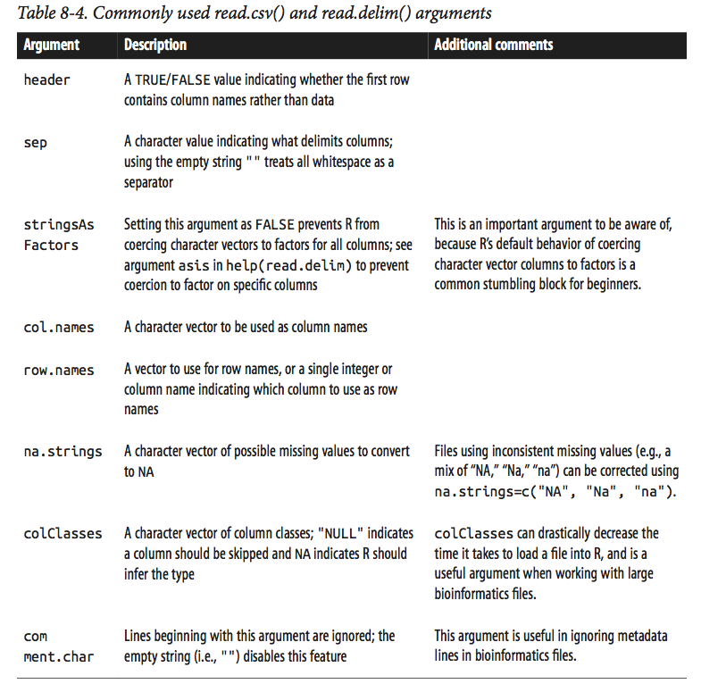

## Data frames {#data-frames}

A data frame is the most common way of storing data in R, and if [used systematically](http://vita.had.co.nz/papers/tidy-data.pdf) makes data analysis easier. Under the hood, a data frame is a list of equal-length vectors. This makes it a 2-dimensional structure, so it shares properties of both the matrix and the list.  This means that a data frame has `names()`, `colnames()`, and `rownames()`, although `names()` and `colnames()` are the same thing. The `length()` of a data frame is the length of the underlying list and so is the same as `ncol()`; `nrow()` gives the number of rows.

You can subset a data frame like a 1d structure (where it behaves like a list), or a 2d structure (where it behaves like a matrix).

### Creation

You create a data frame using `data.frame()`, which takes named vectors as input:

~~~
cats <- data.frame(coat = c("calico", "black", "tabby"), weight = c(2.1, 5.0, 3.2), likes_string = c(1, 0, 1))
str(df)
~~~
{: .r}

~~~
function (x, df1, df2, ncp, log = FALSE)  
~~~
{: .output}

Note that the `data.frame()`'s default behaviour which turns strings into factors. 
Use `stringAsFactors = FALSE` to suppress this behaviour! 

### Testing and coercion

Because a `data.frame` is an S3 class, its type reflects the underlying vector used to build it: the list. To check if an object is a data frame, use `class()` or test explicitly with `is.data.frame()`:

~~~
typeof(cats)
~~~
{: .r}

~~~
[1] "list"
~~~
{: .output}

~~~
class(cats)
~~~
{: .r}

~~~
[1] "data.frame"
~~~
{: .output}

~~~
is.data.frame(cats)
~~~
{: .r}

~~~
[1] TRUE
~~~
{: .output}

You can coerce an object to a data frame with `as.data.frame()`:

* A vector will create a one-column data frame.

* A list will create one column for each element; it's an error if they're 
  not all the same length.
  
* A matrix will create a data frame with the same number of columns and rows as the matrix.

## Reading data into a dataframe

One of R's most powerful features is its ability to deal with tabular data - like what you might already have 
in a spreadsheet or a CSV. The `read.csv` function is used for reading in tabular data stored in a text file 
where the columns of data are delimited by commas (csv = comma separated values). CSV data are read into dataframes.

Let's create a file in the `data/` directory, called `feline-data.csv` with the same data as above:

~~~
coat,weight,likes_string
calico,2.1,1
black,5.0,0
tabby,3.2,1
~~~
{: .r}

> ## Tip: Editing Text files in R
>
> You can create `data/feline-data.csv` using a text editor (vi or Nano),
> or within RStudio with the **File -> New File -> Text File** menu item.
{: .callout}

We can load this into R via the following:

~~~
cats <- read.csv(file = "data/feline-data.csv")
cats
~~~
{: .r}

~~~
    coat weight likes_string
1 calico    2.1            1
2  black    5.0            0
3  tabby    3.2            1
~~~
{: .output}

We can begin exploring our dataset right away, pulling out columns by specifying
them using the `$` operator:

~~~
cats$weight
~~~
{: .r}

~~~
[1] 2.1 5.0 3.2
~~~
{: .output}

~~~
cats$coat
~~~
{: .r}

~~~
[1] calico black  tabby 
Levels: black calico tabby
~~~
{: .output}

We can do other operations on the columns:

~~~
## Say we discovered that the scale weighs two Kg light:
cats$weight + 2
~~~
{: .r}

~~~
[1] 4.1 7.0 5.2
~~~
{: .output}

~~~
paste("My cat is", cats$coat)
~~~
{: .r}

~~~
[1] "My cat is calico" "My cat is black"  "My cat is tabby" 
~~~
{: .output}

We can ask what type of
data something is:

~~~
typeof(cats$weight)
~~~
{: .r}

~~~
[1] "double"
~~~
{: .output}

> ## Subsetting lists and dataframes
> ### Subsetting lists: three functions: `[`, `[[`, and `$`.
>
> Using `[` will always return a list. If you want to *subset* a list, but not
> *extract* an element, then you will likely use `[`.
> 
> ~~~~~~~~~~
> cats[1]
> ~~~~~~~~~~
> {: .source}
>
> To *extract* individual elements of a list, you need to use the double-square
> bracket function: `[[`.
> 
> ~~~~~~~~~~
> cats[[1]]
> ~~~~~~~~~~
> {: .source}
> 
> You **can't** extract more than one element at once:
> 
> ~~~~~~~~~~
> cats[[1:2]]
> ~~~~~~~~~~
> {: .source}
> 
> **Nor** use it to skip elements:
> 
> ~~~~~~~~~~
> cats[[-1]]
> ~~~~~~~~~~
> {: .source}
> 
> But you can use names to both subset and extract elements:
> 
> ~~~~~~~~~~
> d[["coat"]]
> ~~~~~~~~~~
> {: .source}
>
> The `$` function is a shorthand way for extracting elements by name:
> 
> ~~~~~~~~~~
> cats$coat
> ~~~~~~~~~~
> {: .source}
>
> ### Subsetting dataframes
>
> Remember the data frames are lists underneath the hood, so similar rules
> apply. However they are also two dimensional objects:
> 
> `[` with one argument will act the same was as for lists, where each list
> element corresponds to a column. The resulting object will be a data frame:
>
> With two arguments, `[` behaves the same way as for matrices, 
> exctracting raws (first argument) and columns (second argument):
> 
> ~~~~~~~~~~
> cats[1:3,]
> ~~~~~~~~~~
> {: .source}
>
> If we subset a single row, the result will be a data frame (because
> the elements are mixed types):
> 
> ~~~~~~~~~~
> cats[3,]
> ~~~~~~~~~~
> {: .source}
>
> But for a single column the result will be a vector (this can
> be changed with the third argument, `drop = FALSE`).
> 
> ~~~~~~~~~~
> cats[,3]
> ~~~~~~~~~~
> {: .source}
>
{: .callout}

## Adding columns and rows in data frame

We learned last time that the columns in a list (and data frame) were vectors, so that our
data are consistent in type throughout the column. As such, if we want to add a
new column, we need to start by making a new vector:

~~~
age <- c(2,3,5,12)
cats
~~~
{: .r}

~~~
    coat weight likes_string
1 calico    2.1            1
2  black    5.0            0
3  tabby    3.2            1
~~~
{: .output}

We can then add this as a column with the `cbind` function:

~~~
cats <- cbind(cats, age)
~~~
{: .r}

~~~
Error in data.frame(..., check.names = FALSE): arguments imply differing number of rows: 3, 4
~~~
{: .error}

Why didn't this work? Of course, R wants to see one element in our new column
for every row in the table:

~~~
cats
~~~
{: .r}

~~~
    coat weight likes_string
1 calico    2.1            1
2  black    5.0            0
3  tabby    3.2            1
~~~
{: .output}

~~~
age <- c(4,5,8)
cats <- cbind(cats, age)
cats
~~~
{: .r}

~~~
    coat weight likes_string age
1 calico    2.1            1   4
2  black    5.0            0   5
3  tabby    3.2            1   8
~~~
{: .output}

We can also add raws to the dataframe (as lists) (why?):

~~~
newRow <- list("tortoiseshell", 3.3, TRUE, 9)
cats <- rbind(cats, newRow)
~~~
{: .r}

~~~
Warning in `[<-.factor`(`*tmp*`, ri, value = "tortoiseshell"): invalid
factor level, NA generated
~~~
{: .error}

## Factors

The previous command produced a warning: "invalid factor level, NA generated".
This is because when R creates a factor, it only allows whatever is originally 
there when our data was first loaded, which was 'black', 'calico' and 'tabby'. 
Anything new that doesn't fit into one of these categories is rejected as nonsense (becomes NA).

The warning is telling us that we unsuccessfully added 'tortoiseshell' to our
*coat* factor, but 3.3 (a numeric), TRUE (a logical), and 9 (a numeric) were
successfully added to *weight*, *likes_string*, and *age*, respectfully, since
those values are not factors. To successfully add a cat with a
'tortoiseshell' *coat*, explicitly add 'tortoiseshell' as a *level* in the factor:

~~~
levels(cats$coat)
~~~
{: .r}

~~~
[1] "black"  "calico" "tabby" 
~~~
{: .output}

~~~
levels(cats$coat) <- c(levels(cats$coat), 'tortoiseshell')
cats <- rbind(cats, list("tortoiseshell", 3.3, TRUE, 9))
~~~
{: .r}

Alternatively, we can change a factor column to a character vector; we lose the
handy categories of the factor, but can subsequently add any word we want to the
column without babysitting the factor levels:

~~~
str(cats)
~~~
{: .r}

~~~
'data.frame':	5 obs. of  4 variables:
 $ coat        : Factor w/ 4 levels "black","calico",..: 2 1 3 NA 4
 $ weight      : num  2.1 5 3.2 3.3 3.3
 $ likes_string: int  1 0 1 1 1
 $ age         : num  4 5 8 9 9
~~~
{: .output}

~~~
cats$coat <- as.character(cats$coat)
str(cats)
~~~
{: .r}

~~~
'data.frame':	5 obs. of  4 variables:
 $ coat        : chr  "calico" "black" "tabby" NA ...
 $ weight      : num  2.1 5 3.2 3.3 3.3
 $ likes_string: int  1 0 1 1 1
 $ age         : num  4 5 8 9 9
~~~
{: .output}

We can also suppress conversion of character vectors into factors by setting stringsAsFactors=FALSE. This works for data.frame() as well as read.csv() and read.delim().

## Removing rows

We now know how to add rows and columns to our data frame in R - but in our
first attempt to add a 'tortoiseshell' cat to the data frame we've accidentally
added a garbage row:

~~~
cats
~~~
{: .r}

~~~
           coat weight likes_string age
1        calico    2.1            1   4
2         black    5.0            0   5
3         tabby    3.2            1   8
4          <NA>    3.3            1   9
5 tortoiseshell    3.3            1   9
~~~
{: .output}

We can ask for a data frame minus this offending row:

~~~
cats[-4,]
~~~
{: .r}

~~~
           coat weight likes_string age
1        calico    2.1            1   4
2         black    5.0            0   5
3         tabby    3.2            1   8
5 tortoiseshell    3.3            1   9
~~~
{: .output}

Notice the comma with nothing after it indicates that we want to drop the entire fourth row.

Note: We could also remove both new rows at once by putting the row numbers
inside of a vector: `cats[c(-4,-5),]`

Alternatively, we can drop all rows with `NA` values:

~~~
na.omit(cats)
~~~
{: .r}

~~~
           coat weight likes_string age
1        calico    2.1            1   4
2         black    5.0            0   5
3         tabby    3.2            1   8
5 tortoiseshell    3.3            1   9
~~~
{: .output}

> ## What did the previous command do?
>
> It's important to notice that the previous command simply printed our `cats` dataframe excluding some rows
> In order to make changes in the dataframe itself, we want to assign them to the dataset itslef:
>
> ~~~~~~~~
> cats <- cats[-4,]
> ~~~~~~~~
>{: .source}
{:  .callout}

## Appending data frame

The key to remember when adding data to a data frame is that *columns are
vectors or factors, and rows are lists.* We can also glue two data frames
together with `rbind`:

~~~
cats <- rbind(cats, cats)
cats
~~~
{: .r}

~~~
            coat weight likes_string age
1         calico    2.1            1   4
2          black    5.0            0   5
3          tabby    3.2            1   8
4           <NA>    3.3            1   9
5  tortoiseshell    3.3            1   9
6         calico    2.1            1   4
7          black    5.0            0   5
8          tabby    3.2            1   8
9           <NA>    3.3            1   9
10 tortoiseshell    3.3            1   9
~~~
{: .output}
If you assigned row names in your dataframe, they may be unnecessarily complicated when we combine two dataframes. We can remove the rownames, and R will automatically re-name them sequentially:

~~~
rownames(cats) <- NULL
cats
~~~
{: .r}

~~~
            coat weight likes_string age
1         calico    2.1            1   4
2          black    5.0            0   5
3          tabby    3.2            1   8
4           <NA>    3.3            1   9
5  tortoiseshell    3.3            1   9
6         calico    2.1            1   4
7          black    5.0            0   5
8          tabby    3.2            1   8
9           <NA>    3.3            1   9
10 tortoiseshell    3.3            1   9
~~~
{: .output}

> ## Challenge 1
>
> Make a data frame that holds the following information for yourself:
>
> - first name
> - last name
> - lucky number
>
> Then use `rbind` to add an entry for the people sitting beside you.
> Finally, use `cbind` to add a column with each person's answer to the question, "Is it time for a break?"
>
> > ## Solution to Challenge 1
> > 
> > ~~~
> > df <- data.frame(first = c('Grace'),
> >                  last = c('Hopper'),
> >                  lucky_number = c(0),
> >                  stringsAsFactors = FALSE)
> > df <- rbind(df, list('Marie', 'Curie', 238) )
> > df <- cbind(df, coffeetime = c(TRUE,TRUE))
> > ~~~
> > {: .r}
> {: .solution}
{: .challenge}

After all this work, if you want to save your dataframe back to a file use:

~~~
write.csv(cats, file = "data/new_cats.csv")
~~~
{: .r}

## Realistic example

With a knowledge of basic R language essentials, we’re ready to start working with real data. 
We’ll work on a few datasets following examples in Chapter 8 of the Buffalo book. 
All files to load these datasets into R are available in Chapter 8 directory on GitHub.

We starts with Dataset_S1.txt on GitHub, which contains estimates of population genetics statistics such 
as nucleotide diversity (e.g., the columns Pi and Theta), recombination (column Recombination), and sequence 
divergence as estimated by percent identity between human and chimpanzee genomes (column Divergence). 
Other columns contain information about the sequencing depth (depth), and GC content 
(percent.GC). We’ll only work with a few columns in our examples; see the description 
of Dataset_S1.txt in the original paper (Spencer et al.2006) for more detail. 
Dataset_S1.txt includes these estimates for 1kb windows in human chromosome 20.

> ## Miscellaneous Tips
>
>
> * Files can be downloaded directly from the Internet into a local folder of your choice using the `download.file` function.
> The `read.csv` function can then be executed to read the downloaded file from the download location, for example,
> 
> ~~~
> download.file("https://raw.githubusercontent.com/vsbuffalo/bds-files/master/chapter-08-r/Dataset_S1.txt", destfile = "data/Dataset_S1.txt")
> d <- read.csv("data/Dataset_S1.txt")
> ~~~
> {: .r}
>
> * Alternatively, you can read files directly from the Internet into R by replacing the file paths with a web address in `read.csv`. In doing this no local copy of the csv file is first saved onto your computer. For example,
> 
> ~~~
> d <- read.csv("https://raw.githubusercontent.com/vsbuffalo/bds-files/master/chapter-08-r/Dataset_S1.txt")
> ~~~
> {: .r}
>
> * Finally, you can read directly from excel spreadsheets without
> converting them to plain text first by using the [readxl](https://cran.r-project.org/web/packages/readxl/index.html) package.
{: .callout}

Note that R’s read.csv() and read.delim() functions have numerous arguments, many of which will need to be adjusted for certain files you’ll come across in bioinformatics. See table below (Table 8-4 of the Buffalo book) for a list of some commonly used arguments, and/or consult help(read.csv) for full documentation.

image: 

Ok, let’s take a look at the dataframe we’ve loaded in `d` with `str`:

~~~
str(d)
~~~
{: .r}

~~~
'data.frame':	59140 obs. of  16 variables:
 $ start          : int  55001 56001 57001 58001 59001 60001 61001 62001 63001 64001 ...
 $ end            : int  56000 57000 58000 59000 60000 61000 62000 63000 64000 65000 ...
 $ total.SNPs     : int  0 5 1 7 4 6 7 1 1 3 ...
 $ total.Bases    : int  1894 6683 9063 10256 8057 7051 6950 8834 9629 7999 ...
 $ depth          : num  3.41 6.68 9.06 10.26 8.06 ...
 $ unique.SNPs    : int  0 2 1 3 4 2 2 1 1 1 ...
 $ dhSNPs         : int  0 2 0 2 0 1 1 0 0 1 ...
 $ reference.Bases: int  556 1000 1000 1000 1000 1000 1000 1000 1000 1000 ...
 $ Theta          : num  0 8.01 3.51 9.93 12.91 ...
 $ Pi             : num  0 10.35 1.99 9.56 8.51 ...
 $ Heterozygosity : num  0 7.48 1.1 6.58 4.96 ...
 $ X.GC           : num  54.8 42.4 37.2 38 41.3 ...
 $ Recombination  : num  0.0096 0.0096 0.0096 0.0096 0.0096 ...
 $ Divergence     : num  0.00301 0.01802 0.00701 0.01201 0.02402 ...
 $ Constraint     : int  0 0 0 0 0 0 0 0 58 0 ...
 $ SNPs           : int  0 0 0 0 0 0 0 0 1 1 ...
~~~
{: .output}

We can also look at the data in the databrame with the function `head`:

~~~
head(d, n=3)
~~~
{: .r}

~~~
  start   end total.SNPs total.Bases depth unique.SNPs dhSNPs
1 55001 56000          0        1894  3.41           0      0
2 56001 57000          5        6683  6.68           2      2
3 57001 58000          1        9063  9.06           1      0
  reference.Bases Theta     Pi Heterozygosity    X.GC Recombination
1             556 0.000  0.000          0.000 54.8096   0.009601574
2            1000 8.007 10.354          7.481 42.4424   0.009601574
3            1000 3.510  1.986          1.103 37.2372   0.009601574
   Divergence Constraint SNPs
1 0.003006012          0    0
2 0.018018020          0    0
3 0.007007007          0    0
~~~
{: .output}

> ## Challenge 2
>
> Use what you've learned about factors, lists and vectors,
> as well as the output of functions like `colnames` and `dim`
> to explain what everything that `str` prints out for this dataset means.
> If there are any parts you can't interpret, discuss with your neighbors!
>
> > ## Solution to Challenge 2
> >
> > The object `d` is a data frame with 16 columns (variables)
> > - all columns are vectors;
> > - some are integer vectors, other are numeric vectors.
> >
> {: .solution}
{: .challenge}

`str` shows you a lot of information. You can access specific information with functions: `nrow()` (number of rows), `ncol()` (number of columns), and `dim()` (returns both):

~~~
nrow(d) 
~~~
{: .r}

~~~
[1] 59140
~~~
{: .output}

~~~
ncol(d)
~~~
{: .r}

~~~
[1] 16
~~~
{: .output}

~~~
dim(d)
~~~
{: .r}

~~~
[1] 59140    16
~~~
{: .output}

We can also print the columns of this dataframe using colnames() (there’s also a row.names() function):

~~~
colnames(d)
~~~
{: .r}

~~~
 [1] "start"           "end"             "total.SNPs"     
 [4] "total.Bases"     "depth"           "unique.SNPs"    
 [7] "dhSNPs"          "reference.Bases" "Theta"          
[10] "Pi"              "Heterozygosity"  "X.GC"           
[13] "Recombination"   "Divergence"      "Constraint"     
[16] "SNPs"           
~~~
{: .output}

Note that R’s read.csv() function has automatically renamed some of these columns for us: spaces have been converted to periods and the percent sign in %GC has been changed to an “X.” “X.GC” isn’t a very descriptive column name, so let’s change this:

~~~
colnames(d)[12] # original name
~~~
{: .r}

~~~
[1] "X.GC"
~~~
{: .output}

~~~
colnames(d)[12] <- "percent.GC"
~~~
{: .r}

Because the `dataframe$column` command returns a vector, we can pass it to R functions like mean() or summary() to get an idea of what depth looks like across this dataset:

~~~
mean(d$depth)
~~~
{: .r}

~~~
[1] 8.183938
~~~
{: .output}

~~~
summary(d$depth)
~~~
{: .r}

~~~
   Min. 1st Qu.  Median    Mean 3rd Qu.    Max. 
  1.000   6.970   8.170   8.184   9.400  21.910 
~~~
{: .output}

As we saw above, the dollar sign operator is a syntactic shortcut for a more general bracket operator 
used to access rows, columns, and cells of a dataframe.

> ## Selecting multiple rows and/or columns (reminder)
>
> 1. The indexes we use for dataframes can be vectors to select multiple rows and columns simultaneously. 
> 1. Omitting the row index retrieves all rows, and omitting the column index retrieves all columns.
>
> ~~~~~~~~~~
> d[,1:2]
> d[, c("start", "end")]
> d[1, c("start", "end")]
> d[1,]
> d[2, 3]
> ~~~~~~~~~~
>
> {: .source}
{: .callout}

When accessing a single column from a dataframe using [,], R’s default behavior is to return this as a vector—not 
a dataframe with one column. Sometimes this can cause problems if downstream code expects to work with 
a dataframe. To disable this behavior, we set the argument drop to FALSE in the bracket operator:

~~~
d[, "start", drop=FALSE]
~~~
{: .r}

Now, let’s add an additional column to our dataframe that indicates whether a window is in the centromere region. The positions of the chromosome 20 centromere (based on Giemsa banding) are 25,800,000 to 29,700,000 (see this chapter’s README on GitHub to see how these coordinates were found). We can append to our d dataframe a column called cent that has TRUE/FALSE values indicating whether the current window is fully within a centromeric region using comparison and logical operations:

~~~
d$cent <- d$start >= 25800000 & d$end <= 29700000
~~~
{: .r}

> ## Challenge 3
>
> How many windows fall into this centromeric region? 
>
> > ## Solutions to challenge 3
> >
> > We can use `table()` 
> > 
> > ~~~
> > table(d$cent)
> > ~~~
> > {: .r}
> > 
> > 
> > 
> > ~~~
> > 
> > FALSE  TRUE 
> > 58455   685 
> > ~~~
> > {: .output}
> > or sum()
> > 
> > 
> > ~~~
> > sum(d$cent)
> > ~~~
> > {: .r}
> > 
> > 
> > 
> > ~~~
> > [1] 685
> > ~~~
> > {: .output}
> {: .solution}
{: .challenge}

In the dataset we are using, the diversity estimate Pi is measured per sampling window (1kb) and scaled up by 10x (see supplementary Text S1 for more details). It would be useful to have this scaled as per basepair nucleotide diversity (so as to make the scale more intuitive). Hence our next challenge.

> ## Challenge 4
>
> *Create a new rescaled column called diversity, in which the nucleotide diversity is calculated per basepair 
> 
> > ## Solution
> >
> > 
> > ~~~
> > d$diversity <- d$Pi / (10*1000) # rescale, removing 10x and making per bp
> > ~~~
> > {: .r}
> {: .solution}
>
> *Use the `summary()` function to calculate the basic statistics for the nucleotide diversity
>
> > ## Solution
> >
> > 
> > ~~~
> > summary(d$diversity)
> > ~~~
> > {: .r}
> > 
> > 
> > 
> > ~~~
> >      Min.   1st Qu.    Median      Mean   3rd Qu.      Max. 
> > 0.0000000 0.0005577 0.0010420 0.0012390 0.0016880 0.0265300 
> > ~~~
> > {: .output}
> >
> {: .solution}
{: .challenge}

Finally, to make sure our analysis is reproducible, we should put the code
into a script file so we can come back to it later.

> ## Challenge 5
>
> Go to file -> new file -> R script, and write an R script
> to load in the dataset we used and to create additional columns. Put it in the `scripts/`
> directory and add it to version control.
>
> Run the script using the `source` function, using the file path
> as its argument (or by pressing the "source" button in RStudio).
>
> > ## Solution to Challenge 5
> > The contents of `script/first_script.R`:
> > 
> > ~~~
> > d <- read.csv("https://raw.githubusercontent.com/vsbuffalo/bds-files/master/chapter-08-r/Dataset_S1.txt")
> > d$cent <- d$start >= 25800000 & d$end <= 29700000
> > d$diversity <- d$Pi / (10*1000) # rescale, removing 10x and making per bp
> > ~~~
> > {: .r}
> {: .solution}
{: .challenge}

## Exploring Data Through Slicing and Dicing: Subsetting Dataframes

The most powerful feature of dataframes is the ability to slice out specific rows by 
applying the same vector subsetting techniques we used before. Combined with R’s 
comparison and logical operators, this leads to an incredibly powerful method to 
query out rows in a dataframe.

Let’s start by looking at the total number of SNPs per window. From `summary()`, 
we see that this varies quite considerably across all windows on chromosome 20:

~~~
summary(d$total.SNPs)
~~~
{: .r}

~~~
   Min. 1st Qu.  Median    Mean 3rd Qu.    Max. 
  0.000   3.000   7.000   8.906  12.000  93.000 
~~~
{: .output}

Notice how right-skewed this data is: the third quartile is 12 SNPs, but the maximum is 93 SNPs. 
Often we want to investigate such outliers more closely. Let’s use data subsetting to select 
out some rows that have 85 or more SNPs (the number is arbitrary). We can create a logical 
vector containing whether each observation (row) has 85 or more SNPs using the following:

~~~
d$total.SNPs >= 85
~~~
{: .r}
We can use this logical vector to extract the rows of our dataframe that have a TRUE value for d$total.SNPs >= 85:

~~~
d[d$total.SNPs >= 85, ]
~~~
{: .r}

~~~
         start      end total.SNPs total.Bases depth unique.SNPs dhSNPs
2567   2621001  2622000         93       11337 11.34          13     10
12968 13023001 13024000         88       11784 11.78          11      1
43165 47356001 47357000         87       12505 12.50           9      7
      reference.Bases  Theta     Pi Heterozygosity percent.GC
2567             1000 43.420 50.926         81.589    43.9439
12968            1000 33.413 19.030         74.838    28.8288
43165            1000 29.621 27.108         69.573    46.7467
      Recombination Divergence Constraint SNPs  cent diversity
2567    0.000706536 0.01701702          0    1 FALSE 0.0050926
12968   0.000082600 0.01401401          0    1 FALSE 0.0019030
43165   0.000500577 0.02002002          0    7 FALSE 0.0027108
~~~
{: .output}

We can build more elaborate queries by chaining comparison operators. For example, suppose we wanted to see all windows where Pi (nucleotide diversity) is greater than 16 and percent GC is greater than 80.We’d use:

~~~
d[d$Pi > 16 & d$percent.GC > 80, ]
~~~
{: .r}

~~~
         start      end total.SNPs total.Bases depth unique.SNPs dhSNPs
58550 63097001 63098000          5         947  2.39           2      1
58641 63188001 63189000          2        1623  3.21           2      0
58642 63189001 63190000          5        1395  1.89           3      2
      reference.Bases  Theta     Pi Heterozygosity percent.GC
58550             397 37.544 41.172         52.784    82.0821
58641             506 16.436 16.436         12.327    82.3824
58642             738 35.052 41.099         35.842    80.5806
      Recombination Divergence Constraint SNPs  cent diversity
58550   0.000781326 0.03826531        226    1 FALSE 0.0041172
58641   0.000347382 0.01678657        148    0 FALSE 0.0016436
58642   0.000347382 0.01793722          0    0 FALSE 0.0041099
~~~
{: .output}

> ## Discussion time!
> What we just did is really cool, so take a minute to talk to your neighbor to make sure that you/him/her 
> understand how these commands work. So here are some questions to discuss:
> * Why do we need to have d$ before column names?  
> * Do we need a comma? Why?
> * Do we need the space?
> * How can we print only some but not all columns?
> You can try ommitting some of these elements and checking the results
{: .discussion}

Remember, columns of a dataframe are just vectors. If you only need the data from one column, 
just subset it as you would a vector:

~~~
d$percent.GC[d$Pi > 16]
~~~
{: .r}

Subsetting columns can be a useful way to summarize data across two different conditions. 
For example, we might be curious if the average depth in a window (the depth column) 
differs between very high GC content windows (greater than 80%) and all other windows:

~~~
summary(d$depth[d$percent.GC >= 80])
~~~
{: .r}

~~~
   Min. 1st Qu.  Median    Mean 3rd Qu.    Max. 
   1.05    1.89    2.14    2.24    2.78    3.37 
~~~
{: .output}

~~~
summary(d$depth[d$percent.GC < 80])
~~~
{: .r}

~~~
   Min. 1st Qu.  Median    Mean 3rd Qu.    Max. 
  1.000   6.970   8.170   8.185   9.400  21.910 
~~~
{: .output}

This is a fairly large difference, but it’s important to consider how many windows this includes. 
Indeed, there are only nine windows that have a GC content over 80%:

~~~
sum(d$percent.GC >= 80)
~~~
{: .r}

~~~
[1] 9
~~~
{: .output}

> ## Challenge 6
>
> As another example, consider looking at Pi by windows that fall in the centromere and those that do not.
> Does the centromer have higher nucleotide diversity than other regions in these data?
>
> > ## Solutions to challenge 6
> >
> > Because d$cent is a logical vector, we can subset with it directly (and take its complement 
> > by using the negation operator, !):
> > 
> > 
> > ~~~
> > summary(d$Pi[d$cent])
> > ~~~
> > {: .r}
> > 
> > 
> > 
> > ~~~
> >    Min. 1st Qu.  Median    Mean 3rd Qu.    Max. 
> >    0.00    7.95   16.08   20.41   27.36  194.40 
> > ~~~
> > {: .output}
> > 
> > 
> > 
> > ~~~
> > summary(d$Pi[!d$cent])
> > ~~~
> > {: .r}
> > 
> > 
> > 
> > ~~~
> >    Min. 1st Qu.  Median    Mean 3rd Qu.    Max. 
> >   0.000   5.557  10.370  12.290  16.790 265.300 
> > ~~~
> > {: .output}
> > Indeed, the centromere does appear to have higher nucleotide diversity than other regions in this data. 
> >
> {: .solution}
{: .challenge}

In addition to using logical vectors to subset dataframes, it’s also possible to subset 
rows by referring to their integer positions. The function which() takes a vector of 
logical values and returns the positions of all TRUE values. For example:

~~~
d$Pi>3
which(d$Pi > 3)
~~~
{: .r}

Thus, `d[d$Pi > 3, ]` is identical to `d[which(d$Pi > 3), ]`; subsetting operations can be expressed using either method. 
In general, you should omit which() when subsetting dataframes and use logical vectors, 
as it leads to simpler and more readable code. Under other circumstances, which() is 
necessary—for example, if we wanted to select the four first TRUE values in a vector:

~~~
which(d$Pi > 10)[1:4]
~~~
{: .r}

~~~
[1]  2 16 21 23
~~~
{: .output}

which() also has two related functions that return the index of the first minimum or maximum element of a vector: 
which.min() and which.max(). For example:

~~~
d[which.min(d$total.Bases),]
~~~
{: .r}

~~~
         start      end total.SNPs total.Bases depth unique.SNPs dhSNPs
25689 25785001 25786000          0         110     1           0      0
      reference.Bases Theta Pi Heterozygosity percent.GC Recombination
25689             110     0  0              0    38.8388      4.63e-05
      Divergence Constraint SNPs  cent diversity
25689 0.04946043          0    0 FALSE         0
~~~
{: .output}

~~~
d[which.max(d$depth),]
~~~
{: .r}

~~~
       start     end total.SNPs total.Bases depth unique.SNPs dhSNPs
8718 8773001 8774000         58       21914 21.91           7      4
     reference.Bases  Theta     Pi Heterozygosity percent.GC Recombination
8718            1000 17.676 14.199         26.581    39.3393   0.001990459
     Divergence Constraint SNPs  cent diversity
8718 0.01601602          0    1 FALSE 0.0014199
~~~
{: .output}

Sometimes subsetting expressions inside brackets can be quite redundant (because each column must be 
specified like `d$Pi`, `d$depth`, etc). A useful convenience function (intended primarily for interactive use) 
is the R function `subset()`. `subset()` takes two arguments: the dataframe to operate on, and then conditions 
to include a row. With `subset()`, `d[d$Pi > 16 & d$percent.GC > 80, ]` can be expressed as:

~~~
subset(d, Pi > 16 & percent.GC > 80)
~~~
{: .r}

~~~
         start      end total.SNPs total.Bases depth unique.SNPs dhSNPs
58550 63097001 63098000          5         947  2.39           2      1
58641 63188001 63189000          2        1623  3.21           2      0
58642 63189001 63190000          5        1395  1.89           3      2
      reference.Bases  Theta     Pi Heterozygosity percent.GC
58550             397 37.544 41.172         52.784    82.0821
58641             506 16.436 16.436         12.327    82.3824
58642             738 35.052 41.099         35.842    80.5806
      Recombination Divergence Constraint SNPs  cent diversity
58550   0.000781326 0.03826531        226    1 FALSE 0.0041172
58641   0.000347382 0.01678657        148    0 FALSE 0.0016436
58642   0.000347382 0.01793722          0    0 FALSE 0.0041099
~~~
{: .output}

Optionally, a third argument can be supplied to specify which columns (and in what order) to include:

~~~
subset(d, Pi > 16 & percent.GC > 80, c(start, end, Pi, percent.GC, depth))
~~~
{: .r}

~~~
         start      end     Pi percent.GC depth
58550 63097001 63098000 41.172    82.0821  2.39
58641 63188001 63189000 16.436    82.3824  3.21
58642 63189001 63190000 41.099    80.5806  1.89
~~~
{: .output}

Note that we (somewhat magically) don’t need to quote column names. This is because `subset()` follows 
special evaluation rules, and for this reason, `subset()` is best used only for interactive work.

## Merging and Combining Data: Matching Vectors and Merging Dataframes

Bioinformatics analysis often involves connecting datasets: sequencing data, genomic features 
(e.g., gene annotation), functional genomics data, population genetic data, and so on. As data piles 
up in repositories, the ability to connect different datasets together to tell a cohesive story will 
become an increasingly more important analysis skill. In this section, we’ll look at some canonical 
ways to combine datasets together in R.

Before we do, we'll download two datasets:

~~~
download.file("https://raw.githubusercontent.com/vsbuffalo/bds-files/master/chapter-08-r/chrX_rmsk.txt.gz", destfile = "data/chrX_rmsk.txt.gz")
reps <- read.delim("data/chrX_rmsk.txt.gz")
~~~
{: .r}

Let's look at these files:

~~~
head(reps, 3)
~~~
{: .r}

~~~
  bin swScore milliDiv milliDel milliIns genoName genoStart genoEnd
1 585     342        0        0        0     chrX         0      38
2 585     392      109        0        0     chrX        41     105
3 585     302      240       31       20     chrX       105     203
    genoLeft strand   repName      repClass     repFamily repStart repEnd
1 -154824226      + (CCCTAA)n Simple_repeat Simple_repeat        3     40
2 -154824159      +    LTR12C           LTR          ERV1     1090   1153
3 -154824061      +     LTR30           LTR          ERV1      544    642
  repLeft id
1       0  1
2    -425  2
3     -80  3
~~~
{: .output}

~~~
head(mtfs, 3)
~~~
{: .r}

~~~
Error in head(mtfs, 3): object 'mtfs' not found
~~~
{: .error}

The first file shows the repeats on human chromosome X found by Repeat Masker.  Here repClass is an example of a factor column — try `class(reps$repClass)` and `levels(reps$repClass)`. Suppose we wanted to select out rows for some common repeat classes: DNA, LTR, LINE, SINE, and Simple_repeat. We can construct a statement to select these values using logical operators: 

~~~
reps$repClass == "SINE" | reps$repClass == "LINE" | reps$repClass == "LTR" | reps$repClass == "DNA" | reps$repClass == "Simple_repeat"
~~~
{: .r}

However, this approach is tedious and error prone.

Instead, we can use the  R’s %in% operator, which returns a logical vector indicating which of the values of x are in y. E.g.,:

~~~
c(3,4,-1)%in%c(1,3,4,8)
~~~
{: .r}

~~~
[1]  TRUE  TRUE FALSE
~~~
{: .output}

In our case:

~~~
common_repclass <- c("SINE", "LINE", "LTR", "DNA", "Simple_repeat") 
reps[reps$repClass %in% common_repclass, ]
~~~
{: .r}

Note, that we can also create common_repclass vector programmatically:

~~~
top5_repclass <- names(sort(table(reps$repClass), decreasing=TRUE)[1:5])
top5_repclass
~~~
{: .r}

~~~
[1] "LINE"          "SINE"          "LTR"           "Simple_repeat"
[5] "DNA"          
~~~
{: .output}

The `%in%` operator is a simplified version of another function, `match()`. `x %in% y` returns TRUE/FALSE for 
each value in x depending on whether it’s in y. In contrast, `match(x, y)` returns the first occurrence of 
each of x’s values in y. Back to our previous example:

~~~
match(c(3,4,-1),c(1,3,4,8))
~~~
{: .r}

~~~
[1]  2  3 NA
~~~
{: .output}

Note, the vector returned will always have the same length as the first argument and contains positions in the second argument.

Because match() returns where it finds a particular value, match()’s output can be used to join two 
data frames together by a shared column. Here we’ll merge two datasets to explore recombination 
rates around a degenerate sequence motif that occurs in repeats.  The first dataset contains 
estimates of the recombination rate for all windows within 40kb of each motif (for two motif variants).
The second dataset (motif_repeats.txt) contains which repeat each motif occurs in. Our goal is to merge 
these two datasets so that we can look at the local effect of recombination of each motif on specific repeat backgrounds.

Let’s start by loading in both files and peeking at them with head():

~~~
mtfs <- read.delim("https://raw.githubusercontent.com/vsbuffalo/bds-files/master/chapter-08-r/motif_recombrates.txt", header=TRUE)
rpts <- read.delim("https://raw.githubusercontent.com/vsbuffalo/bds-files/master/chapter-08-r/motif_repeats.txt", header=TRUE)
head(mtfs, 3)
~~~
{: .r}

~~~
   chr motif_start motif_end    dist recomb_start recomb_end  recom
1 chrX    35471312  35471325 39323.0     35430651   35433340 0.0015
2 chrX    35471312  35471325 36977.0     35433339   35435344 0.0015
3 chrX    35471312  35471325 34797.5     35435343   35437699 0.0015
          motif           pos
1 CCTCCCTGACCAC chrX-35471312
2 CCTCCCTGACCAC chrX-35471312
3 CCTCCCTGACCAC chrX-35471312
~~~
{: .output}

~~~
head(rpts, 3)
~~~
{: .r}

~~~
   chr     start       end name motif_start
1 chrX  63005829  63006173   L2    63005830
2 chrX  67746983  67747478   L2    67747232
3 chrX 118646988 118647529   L2   118647199
~~~
{: .output}

> ## Discussion time!
> Examine these two files and discuss the following questions with your neighbor
> * How long is/are the motif(s) we are interested in?
> * Why do we see the same motif on multiple lines in the dataset1?
> * Why do we have two "start" columns in the second dataset?
> * Can we have two columns with the same start/end in the dataset2?
> * What column(s) can we use to combine these two datasets?
> * What is our goal, again?
{: .discussion}

OK, so what we are trying to do is to add the colun "name" from the second dataset to the first one, 
to see whether and in which repeat each motif is contained.

Because we are dealing with multiple chromosomes, we start by merging two column, `chr` and `motif_start`:

~~~
mtfs$pos <- paste(mtfs$chr, mtfs$motif_start, sep="-")
rpts$pos <- paste(rpts$chr, rpts$motif_start, sep="-")
~~~
{: .r}

Now, this pos column functions as a common key between the two datasets.
Let's validate that our keys overlap in the way we think they do before merging:

~~~
table(mtfs$pos %in% rpts$pos)
~~~
{: .r}

~~~

FALSE  TRUE 
10832  9218 
~~~
{: .output}

Now, we use match() to find where each of the `mtfs$pos` keys occur in the `rpts$pos`. 
We’ll create this indexing vector first before doing the merge:

~~~
i <- match(mtfs$pos, rpts$pos)
~~~
{: .r}

All motif positions without a corresponding entry in rpts are NA; our number of NAs
is exactly the number of `mts$pos` elements not in `rpts$pos`:

~~~
table(is.na(i))
~~~
{: .r}

~~~

FALSE  TRUE 
 9218 10832 
~~~
{: .output}

Finally, using this indexing vector we can select out the appropriate elements of rpts $name and merge these into mtfs:

~~~
mtfs$repeat_name <- rpts$name[i]
~~~
{: .r}

Often in practice you might skip assigning match()’s results to i and use this directly:

~~~
mtfs$repeat_name <- rpts$name[match(mtfs$pos, rpts$pos)]
~~~
{: .r}

Let's check our result:

~~~
head(mtfs[!is.na(mtfs$repeat_name), ], 3)
~~~
{: .r}

~~~
     chr motif_start motif_end    dist recomb_start recomb_end  recom
99  chrX    63005830  63005843 37772.0     62965644   62970485 1.4664
100 chrX    63005830  63005843 34673.0     62970484   62971843 0.0448
101 chrX    63005830  63005843 30084.5     62971842   62979662 0.0448
            motif           pos repeat_name
99  CCTCCCTGACCAC chrX-63005830          L2
100 CCTCCCTGACCAC chrX-63005830          L2
101 CCTCCCTGACCAC chrX-63005830          L2
~~~
{: .output}

Great, we’ve combined the `rpts$name` vector directly into our mtfs dataframe. Not all motifs have 
entries in rpts, so some values in `mfs$repeat_name` are NA. We could easily remove these NAs with:

~~~
mtfs_inner <- mtfs[!is.na(mtfs $repeat_name), ]
nrow(mtfs_inner)
~~~
{: .r}

~~~
[1] 9218
~~~
{: .output}

In this case, only motifs in mtfs contained in a repeat in rpts are kept (technically, this type of join is called an inner join). Inner joins are the most common way to merge data. 

We’ve learned match() first because it’s a general, extensible way to merge data in R. 
However, R does have a more user-friendly merging function: merge(). 
Merge can directly merge two datasets:

~~~
recm <- merge(mtfs, rpts, by.x="pos", by.y="pos")
head(recm, 2)
~~~
{: .r}

~~~
             pos chr.x motif_start.x motif_end    dist recomb_start
1 chr1-101890123  chr1     101890123 101890136 34154.0    101855215
2 chr1-101890123  chr1     101890123 101890136 35717.5    101853608
  recomb_end  recom         motif repeat_name chr.y     start       end
1  101856736 0.0700 CCTCCCTAGCCAC       THE1B  chr1 101890032 101890381
2  101855216 0.0722 CCTCCCTAGCCAC       THE1B  chr1 101890032 101890381
   name motif_start.y
1 THE1B     101890123
2 THE1B     101890123
~~~
{: .output}

~~~
nrow(recm)
~~~
{: .r}

~~~
[1] 9218
~~~
{: .output}

`merge()` takes two dataframes, x and y, and joins them by the columns supplied by by.x and by.y. 
If they aren’t supplied, merge() will try to infer what these columns are, but it’s much safer 
to supply them explicitly. If you want to keep all rows in both datasets, you can specify `all=TRUE`. 
See `help(merge)` for more details on how merge() works. 

> ## Vince Buffalo's guidelines for combining data:
>
> 1. Carefully consider the structure of both datasets;
> 2. Validate that your keys overlap in the way you think they do before merging;
> 3. Validate, validate, validate!
>
{: .callout}
