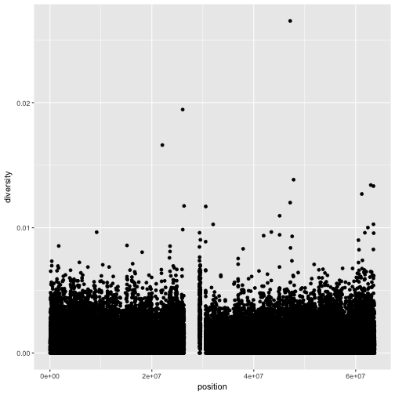
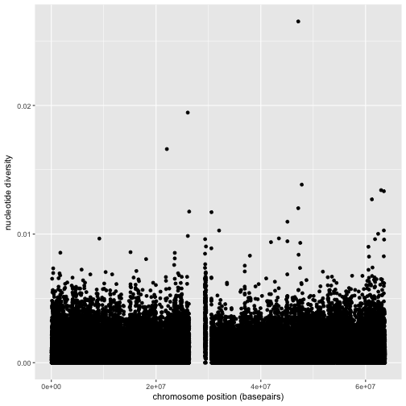
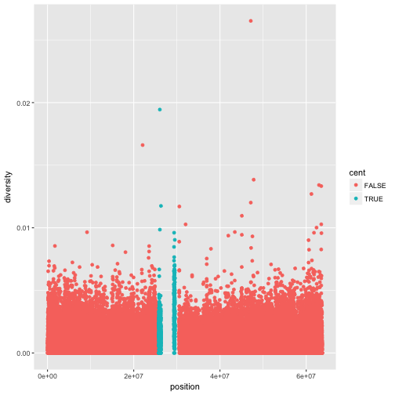
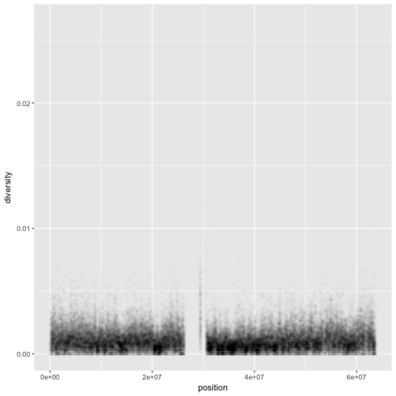
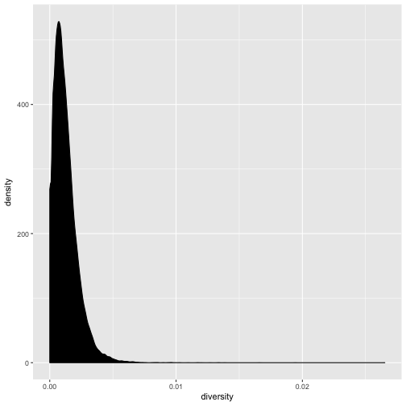
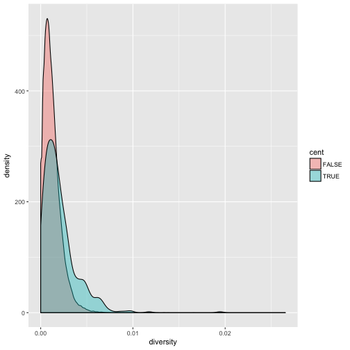
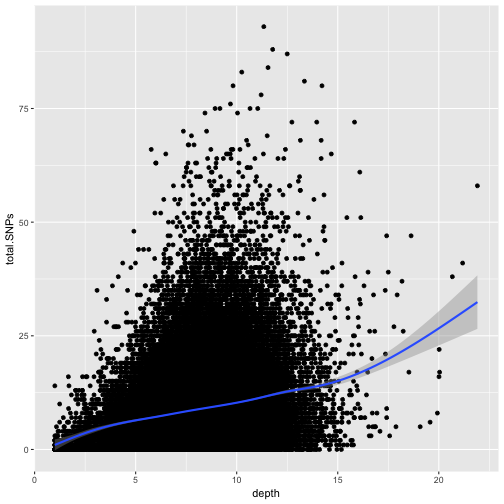
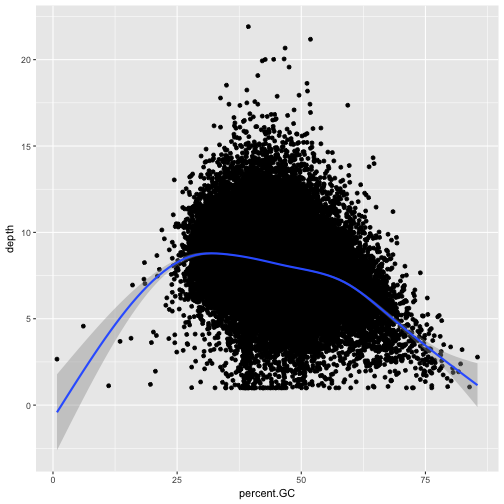
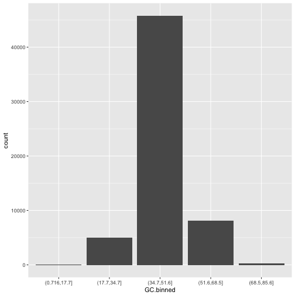
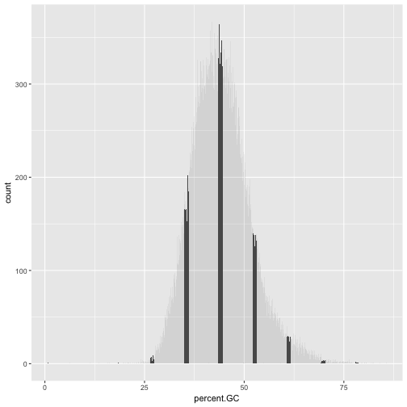

## A Brief Intro
Exploratory data analysis emphasizes visualization as the best tool to understand and 
explore our data—both to learn what the data says and what its limitations are. 

There are three main plotting systems in R,
the [base plotting system][base], the [lattice][lattice]
package, and the [ggplot2][ggplot2] package.

[base]: http://www.statmethods.net/graphs/
[lattice]: http://www.statmethods.net/advgraphs/trellis.html
[ggplot2]: http://www.statmethods.net/advgraphs/ggplot2.html

Every R user should be acquainted with base graphics (at some point, you’ll encounter 
a base graphics plot you need to modify), but we’re going to skip base graphics to 
focus entirely on learning visualization with ggplot2. The reason for this is simple: 
you’ll be able to create more informative plots with less time and effort invested with 
ggplot2 than possible with base graphics. 

Note, ggplot2 works exclusively with dataframes, 
so you’ll need to get your data tidy and into a dataframe before visualizing it with ggplot2.

The best up-to-date reference for ggplot2 is the [ggplot2 online documentation](http://docs.ggplot2.org/).
More advanced information can be found in the books [ggplot2: Elegant Graphics for Data Analysis](https://github.com/hadley/ggplot2-book) by Hadley Wickham 
(Springer, 2010) and [R Graphics Cookbook](http://shop.oreilly.com/product/0636920023135.do) by Winston Chang (O’Reilly, 2012).

ggplot2 is built on the grammar of graphics, the idea that any plot can be
expressed from the same set of components: a **data** set, a
**coordinate system**, and a set of **geoms**--the visual representation of data
points.

The key to understanding ggplot2 is thinking about a figure in layers.
This idea may be familiar to you if you have used image editing programs like Photoshop, Illustrator, or
Inkscape.

## Exploring Data Visually with ggplot2 I: Scatterplots and Densities

First, we need to load the ggplot2 package with R’s library() function. We'll use a different function to check whether ggplot2 is installed.

~~~
if (!require("ggplot2")) install.packages("ggplot2")
~~~
{: .r}

~~~
Loading required package: ggplot2
~~~
{: .output}

~~~
library(ggplot2)
~~~
{: .r}

Let’s look at how we’d use ggplot2 to create a scatterplot of nucleotide diversity along the chromosome 
in the diversity column in our d dataframe. Because our data is window-based, we’ll first add a column 
called position to our dataframe that’s the midpoint between each window:

~~~
d$position <- (d$end + d$start) / 2
ggplot(d) + geom_point(aes(x=position, y=diversity))
~~~
{: .r}

There are two components of this ggplot2 graphic: the call to the function `ggplot()`, 
and the call to the function `geom_point()`. First, we use `ggplot(d)` to supply this plot with our d dataframe. 
Second, with our data specified, we then add layers to our plot (remember: ggplot2 is layer-based). 
To add a layer, we use the same `+` operator that we use for addition in R.

We add `geom_point()` as a layer because we want points to create a scatterplot. `geom_point()` is a type of 
geometric object (or geom in ggplot2 lingo). ggplot2 has many geoms (e.g., `geom_line()`, `geom_bar()`, 
`geom_density()`, `geom_boxplot()`, etc.)

Geometric objects have many aesthetic attributes (e.g., x and y positions, color, shape, size, etc.). 
The beauty of ggplot2s grammar is that it allows you to map geometric objects’ aesthetics to columns in your dataframe. 
In our diversity by position scatterplot, we mapped the x position aesthetic to the position column, and the y position to the diversity column. We specify the mapping of aesthetic attributes to columns in our dataframe using the function aes().

Note, that aesthetic mappings can also be specified in the call to ggplot()—geoms will then use this mapping:

~~~
ggplot(d, aes(x=position, y=diversity)) + geom_point()
~~~
{: .r}

> ## Challenge 1
>
> While ggplot2 chooses smart labels based on your column names, you might want to change this down the road. 
> ggplot2 makes specifying labels easy: simply use the xlab(), ylab(), and ggtitle() functions to specify 
> the x-axis label, y-axis label, and plot title. Change x- and y-axis labels when plotting the diversity data with 
> x label "chromosome position (basepairs)" and y label "nucleotide diversity". 
>
> > ## Solution to challenge 1
> >
> > 
> > ~~~
> > ggplot(d) + geom_point(aes(x=position, y=diversity)) + xlab("chromosome position (basepairs)") + ylab("nucleotide diversity")
> > ~~~
> > {: .r}
> > 
> > 
> {: .solution}
{: .challenge}

Notice the missing diversity estimates in the middle of this plot. What’s going on in this region? 
ggplot2’s strength is that it makes answering these types of questions with exploratory data analysis 
techniques effortless. We simply need to map a possible confounder or explanatory variable to another 
aesthetic and see if this reveals any unexpected patterns. In this case, let’s map the color aesthetic 
of our point geometric objects to the column cent, which indicates whether the window falls in the 
centromeric region of this chromosome

~~~
ggplot(d) + geom_point(aes(x=position, y=diversity, color=cent))
~~~
{: .r}

One problem with our plots is the degree of overplotting (data oversaturating a plot so as to obscure 
the information of other data points). We can’t get a sense of the distribution of diversity from this 
figure everything is saturated from about 0.05 and below. One way to alleviate overplotting is to make 
points somewhat transparent (the transparency level is known as the alpha):

~~~
ggplot(d) + geom_point(aes(x=position, y=diversity), alpha=0.01)
~~~
{: .r}

> ## Note
> There’s a subtlety here that illustrates a very important ggplot2 concept: we set alpha=0.01 
> outside of the aesthetic mapping function aes(). This is because we’re not mapping the alpha 
> aesthetic to a column of data in our dataframe, but rather giving it a fixed value for all data points.
{: .callout}

Let’s now look at the density of diversity across all positions. We’ll use a different geometric object, 
geom_density(), which is slightly different than geom_point() in that it takes the data and calculates 
a density from it for us:

~~~
ggplot(d) + geom_density(aes(x=diversity), fill="black")
~~~
{: .r}

We can also map the color aesthetic of geom_density() to a discrete-valued column in our dataframe, 
just as we did with geom_point(). geom_density() will create separate density plots, grouping data 
by the column mapped to the color aesthetic and using colors to indicate the different densities. 
To see both overlapping densities, we use alpha to set the transparency to 0.4:

~~~
ggplot(d) + geom_density(aes(x=diversity, fill=cent), alpha=0.4)
~~~
{: .r}

Immediately we’re able to see a trend that wasn’t clear by using a scatterplot: diversity is 
skewed to more extreme values in centromeric regions. Again (because this point is worth repeating), 
mapping columns to additional aesthetic attributes can reveal patterns and information in the data 
that may not be apparent in simple plots. 

## Exploring Data Visually with ggplot2 II: Smoothing
Let’s look at the Dataset_S1.txt data using another useful ggplot2 feature: smoothing. 
We’ll use ggplot2 in particular to investigate potential confounders in genomic data. 
There are numerous potential confounders in genomic data (e.g., sequencing read depth; 
GC content; mapability, or whether a region is capable of having reads correctly align 
to it; batch effects; etc.). Often with large and high-dimension datasets, visualization 
is the easiest and best way to spot these potential issues.

Earlier, we used transparency to give us a sense of the most dense regions. Another 
strategy is to use ggplot2’s geom_smooth() to add a smoothing line to plots and look 
for an unexpected trend. Let’s use a scatterplot and smoothing curve to look at the 
relationship between the sequencing depth (the depth column) and the total number of 
SNPs in a window (the total.SNPs column):

~~~
ggplot(d, aes(x=depth, y=total.SNPs)) + geom_point() + geom_smooth()
~~~
{: .r}

~~~
`geom_smooth()` using method = 'gam'
~~~
{: .output}

Notice that because both geom_point() and geom_smooth() use the same x and y mapping, we can specify 
the aesthetic in ggplot() function.

> ## Discussion
>
> What does this graph tells us about the relationship between depth of sequencing and SNPs?
>
{: .discussion}

> ## Challenge 2
>
> Explore the effect GC content has on depth of sequencing in the dataset. 
>
> > ## Solution to challenge 2
> >
> > 
> > ~~~
> > ggplot(d, aes(x=percent.GC, y=depth)) + geom_point() + geom_smooth()
> > ~~~
> > {: .r}
> > 
> > 
> > 
> > ~~~
> > `geom_smooth()` using method = 'gam'
> > ~~~
> > {: .output}
> > 
> > 
> {: .solution}
{: .challenge}

## Binning Data with cut() and Bar Plots with ggplot2

Another way we can extract information from complex datasets is by reducing the resolution of 
the data through binning (or discretization). Binning takes continuous numeric values and places 
them into a discrete number of ranged bins. The benefit is that discrete bins facilitate 
conditioning on a variable. Conditioning is an incredibly powerful way to reveal patterns in data. 

In R, we bin data through the cut() function:

~~~
d$GC.binned <- cut(d$percent.GC, 5)
head(d$GC.binned)
~~~
{: .r}

~~~
[1] (51.6,68.5] (34.7,51.6] (34.7,51.6] (34.7,51.6] (34.7,51.6] (34.7,51.6]
5 Levels: (0.716,17.7] (17.7,34.7] (34.7,51.6] ... (68.5,85.6]
~~~
{: .output}

When cut()’s second argument breaks is a single number, cut() divides the data into that 
number of equally sized bins. The returned object is a factor. The levels of the factor 
returned from cut() will always have labels like (34.7,51.6], which indicate the particular 
bin that value falls in. We can count how many items fall into a bin using table():

~~~
table(d$GC.binned)
~~~
{: .r}

~~~

(0.716,17.7]  (17.7,34.7]  (34.7,51.6]  (51.6,68.5]  (68.5,85.6] 
           6         4976        45784         8122          252 
~~~
{: .output}

We can also use prespecified ranges when binning data with cut() by setting breaks to a vector:

~~~
cut(d$percent.GC, c(0, 25, 50, 75, 100))
~~~
{: .r}

Bar plots are the natural visualization tool to use when looking at count data like the number 
of occurrences in bins created with cut():

~~~
ggplot(d) + geom_bar(aes(x=GC.binned))
~~~
{: .r}

When geom_bar()’s x aesthetic is a factor (e.g., d$binned.GC), ggplot2 will create a bar plot of counts. 
However, if geom_bar()’s x aesthetic is mapped to a continuous column (e.g., percent.GC) geom_bar() 
will automatically bin the data itself, creating a histogram:

~~~
ggplot(d) + geom_bar(aes(x=percent.GC))
~~~
{: .r}

The bins created from cut() are useful in grouping data (a concept we often use in data analysis). 
For example, we can use the GC.binned column to group data by %GC content bins to see how GC content 
has an impact on other variables. To do this, we map aesthetics like color, fill, or linetype to our GC.binned column:

~~~
ggplot(d) + geom_density(aes(x=depth, linetype=GC.binned), alpha=0.5)
~~~
{: .r}

> ## Challenge 3: Finding the Right Bin Width
> 
> We've seen before how different bin widths can drastically change the way we view and 
> understand the data. Try creating a histogram of Pi with varying binwidths using: `ggplot(d) + geom_bar(aes(x=Pi), 
> binwidth=1) + scale_x_continu ous(limits=c(0.01, 80))`. Using scale_x_continuous() just 
> ignores all windows with 0 Pi and zooms into the figure. Try binwidths of 0.05, 0.5, 
> 1, 5, and 10. What do you observe?  
>
> > ## Solution to challenge 3
> >
> > Smaller bin widths can fit the data better (revealing more subtle details 
> > about the distribution), but there’s a trade-off. As bin widths become narrower, each 
> > bin will contain fewer data points and con‐ sequently be more noisy (and undersmoothed). 
> > Using wider bins smooth over this noise. However, bins that are too wide result in oversmoothing, 
> > which can hide details about the data.
> > ggplot(d, aes(x=percent.GC, y=depth)) + geom_point() + geom_smooth()
> {: .solution}
{: .challenge}

This is a taste of what you can do with `ggplot2`. RStudio provides a
really useful [cheat sheet][cheat] of the different layers available, and more
extensive documentation is available on the [ggplot2 website][ggplot-doc].
Finally, if you have no idea how to change something, a quick Google search will
usually send you to a relevant question and answer on Stack Overflow with reusable
code to modify!

[cheat]: http://www.rstudio.com/wp-content/uploads/2015/03/ggplot2-cheatsheet.pdf
[ggplot-doc]: http://docs.ggplot2.org/current/
