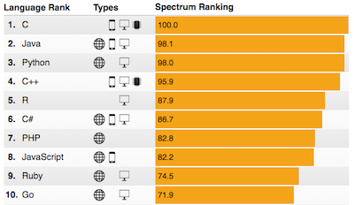

## Welcome to the R part of the BCB546 course!

Our goal here is to teach you the basics of R and best practices of using R for data analysis. 
For some of these lessons we are using a modified version of the Software Carpentry workshop 
[R for Reproducible Scientific Analysis](http://swcarpentry.github.io/r-novice-gapminder/). 
Other lessons follow Chapter 8 of the [Bioinformatics Data Skills](http://shop.oreilly.com/product/0636920030157.do) 
book by [Vince Buffalo](https://github.com/vsbuffalo).

## Why R?

## Brief Introduction to R 
#### (from [www.r-project.org](www.r-project.org))

R is a language and environment for statistical computing and graphics. It is a GNU project which is similar 
to the S language and environment which was developed at Bell Laboratories (formerly AT&T, now Lucent Technologies) 
by John Chambers and colleagues. R can be considered as a different implementation of S. There are some important 
differences, but much code written for S runs unaltered under R.

R provides a wide variety of statistical and graphical techniques, and is highly extensible. 
The S language is often the vehicle of choice for research in statistical methodology, and R 
provides an Open Source route to participation in that activity.

One of R’s strengths is the ease with which well-designed publication-quality plots can be produced, 
including mathematical symbols and formulae where needed. Great care has been taken over the defaults 
for the minor design choices in graphics, but the user retains full control.

R is available as Free Software under the terms of the Free Software Foundation’s GNU General Public 
License in source code form. It compiles and runs on a wide variety of UNIX platforms and similar 
systems (including FreeBSD and Linux), Windows and MacOS.

Note that our lessons will focus on teaching the fundamentals of the
programming language R, and will not teach statistical analysis.

> ## Additional resources  
>
> #### Here are some additional resources that we found very useful:  
>
> * The R Project: [https://www.r-project.org/](https://www.r-project.org/)
> * Advanced R (book): [http://adv-r.had.co.nz/](http://adv-r.had.co.nz/)
> * Biocunductor: [http://www.bioconductor.org/](http://www.bioconductor.org/)
> * Cookbook for R: [http://www.cookbook-r.com/](http://www.cookbook-r.com/)
> * R for Data Science (book): [http://r4ds.had.co.nz/](http://r4ds.had.co.nz/)
> * RStudio: [https://www.rstudio.com/](https://www.rstudio.com/)
{: .callout}

> ## Prerequisites
>
> Understand that computers store data and instructions (programs, scripts etc.) in files.
> Files are organised in directories (folders).
> Know how to access files not in the working directory by specifying the path.
{: .prereq}
